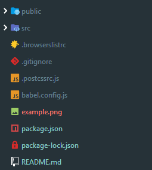
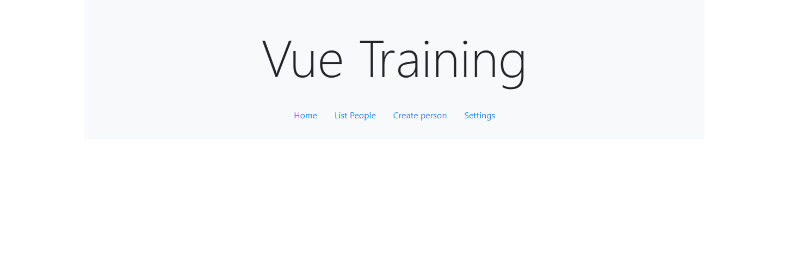

# Vue Training
This repository is for the Vue Training session on 1st May 2019. Please follow the below instructions to create the application.

## Prerequisites
To install this application you will need:
	
 - [NodeJs](https://nodejs.org/en/) - Version 10 or more
 - [Git](https://git-scm.com/) - (Optional) - To clone this repository, you will have access to the branches.

### Check you have node
```bash
npm -v
```
This should return version
```bash
6.5.0
```

## Installing the application

### Step 1
Download this repository or git clone the repository.

The repository should look like this when cloned/downloaded.



### Step 2
Change into the directory using:

```bash
cd vue-training
```

Install the node modules using the following command:
```bash
npm install
```

### Step 3
You should now have the `node_modules` installed, now we need to open the application, now we can open the development server.

```bash
npm run serve
```

This will spin up a development server, build the application for development usage and provide a url to view the running application.
```bash
App running at:
- Local:   http://localhost:8080/
- Network: http://192.168.1.98:8080/
```

### Step 4
Now if you visit the url in your browser you should see this:



## Installing the vue cli

To install this just run this command:

```bash
npm install -g @vue/cli-service-global
```